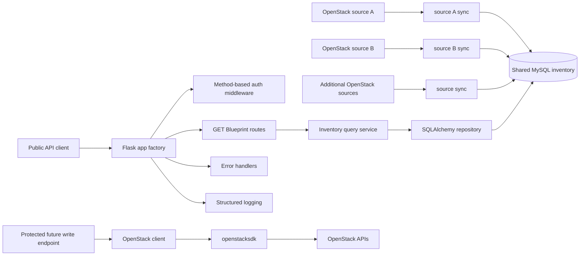

# openstack-middleware-api

A production-ready Flask middleware API for exposing selected OpenStack
infrastructure data through public, normalized REST endpoints. Public read
endpoints query one shared MySQL inventory database populated by a separate
inventory sync service for multiple OpenStack projects. One API service returns
global inventory across all active inventory sources by default. The OpenStack
SDK client is retained for future authenticated mutating endpoints.

## Architecture



- `app/__init__.py` creates the Flask app and wires configuration, middleware,
  Blueprints, logging, and error handlers.
- `app/routes/` contains thin route handlers for health checks and inventory
  resources.
- `app/openapi.py` builds and serves the OpenAPI contract and Swagger UI.
- `app/schemas/` contains Marshmallow schemas for public response contracts.
- `app/database/` owns SQLAlchemy engine/session setup and read-only table
  descriptions for the sync-owned inventory schema.
- `app/repositories/inventory.py` owns active-source SQL queries, source
  filtering, and tag/address loading without implicit pagination.
- `app/services/inventory_query.py` validates request filters and normalizes
  database rows into safe public JSON payloads.
- `app/services/openstack_client.py` keeps lazy `openstacksdk` support for
  future authenticated write operations.
- `app/middleware/auth.py` applies reusable method-based bearer API key checks.
- `app/errors/handlers.py` returns consistent, client-safe error responses.
- `app/utils/logging.py` emits structured request logs without secrets.
- `docker/` contains the production Gunicorn runtime configuration.
- `tests/` uses SQLite-backed inventory fixtures for GET routes and keeps
  OpenStack client tests for future write behavior.

## Directory Structure

```text
openstack-middleware-api/
├── app/
│   ├── __init__.py
│   ├── config.py
│   ├── openapi.py
│   ├── database/
│   │   ├── __init__.py
│   │   ├── engine.py
│   │   ├── models.py
│   │   └── session.py
│   ├── repositories/
│   │   ├── __init__.py
│   │   └── inventory.py
│   ├── routes/
│   │   ├── __init__.py
│   │   ├── health.py
│   │   └── openstack.py
│   ├── schemas/
│   │   ├── __init__.py
│   │   ├── common.py
│   │   ├── flavor.py
│   │   ├── health.py
│   │   ├── image.py
│   │   ├── inventory_source.py
│   │   ├── network.py
│   │   ├── project.py
│   │   └── server.py
│   ├── services/
│   │   ├── __init__.py
│   │   ├── inventory_query.py
│   │   └── openstack_client.py
│   ├── middleware/
│   │   ├── __init__.py
│   │   └── auth.py
│   ├── errors/
│   │   ├── __init__.py
│   │   └── handlers.py
│   └── utils/
│       ├── __init__.py
│       └── logging.py
├── docker/
│   └── gunicorn.conf.py
├── tests/
│   ├── test_health.py
│   ├── test_inventory_api.py
│   ├── test_docker.py
│   ├── test_openapi.py
│   ├── test_auth.py
│   ├── test_openstack.py
│   └── test_server_tags.py
├── instance/
├── .dockerignore
├── .env.example
├── .env.docker.example
├── .github/workflows/ci.yml
├── .gitignore
├── .pre-commit-config.yaml
├── AGENTS.md
├── Dockerfile
├── LICENSE
├── docker-compose.override.yml.example
├── docker-compose.yml
├── pyproject.toml
├── README.md
└── run.py
```

## Installation

```bash
python3.12 -m venv .venv
source .venv/bin/activate
python -m pip install --upgrade pip
python -m pip install -e ".[dev]"
```

## Environment Variables

Copy the example file and fill in values for your environment:

```bash
cp .env.example .env
```

Required inventory and API settings:

```text
API_KEY=
INVENTORY_MAX_AGE_SECONDS=900
MYSQL_HOST=<MYSQL_HOST>
MYSQL_PORT=3306
MYSQL_DATABASE=<MYSQL_DATABASE>
MYSQL_USERNAME=<MYSQL_READONLY_USER>
MYSQL_PASSWORD=
MYSQL_CHARSET=utf8mb4
MYSQL_POOL_SIZE=5
MYSQL_MAX_OVERFLOW=10
MYSQL_POOL_RECYCLE=1800
```

OpenAPI and reverse-proxy settings:

```text
OPENAPI_ENABLED=true
OPENAPI_DOCS_PATH=/docs
OPENAPI_SPEC_PATH=/openapi.json

TRUST_PROXY_HEADERS=false
PROXY_FIX_X_FOR=1
PROXY_FIX_X_PROTO=1
PROXY_FIX_X_HOST=1
PROXY_FIX_X_PORT=1
PROXY_FIX_X_PREFIX=0
```

Swagger UI and the OpenAPI JSON document are enabled by default. Set
`OPENAPI_ENABLED=false` to return HTTP 404 for both documentation endpoints.
Custom docs/spec paths must start with `/`, must not end with `/`, must be
different from each other, and must not conflict with `/health` or `/api/`
routes.

`TRUST_PROXY_HEADERS` is disabled by default. Enable it only when the API is
behind a trusted reverse proxy that overwrites client-supplied forwarding
headers. The `PROXY_FIX_X_*` values control how many proxy hops Werkzeug should
trust for each header family.

`INVENTORY_SCOPE` is deprecated and ignored by the global API. If it remains in
an old environment file, it will not restrict results to any single source. Use
optional query parameters such as `?scope=<scope>` when a client wants to filter
results.

GET endpoints do not require working OpenStack credentials at application
startup and do not query OpenStack. OpenStack configuration is retained for
future authenticated write endpoints and is validated lazily when the OpenStack
client is used.

```text
OS_AUTH_TYPE=
OS_AUTH_URL=
OS_REGION_NAME=
OS_INTERFACE=
OS_IDENTITY_API_VERSION=
```

`OS_IDENTITY_API_VERSION` should normally be `3`, and `OS_INTERFACE` should
usually be `public`. `OS_AUTH_TYPE` defaults to `application_credential` when
unset for backward compatibility.

## OpenStack Auth Modes

The service supports two OpenStack auth modes:

- `application_credential`: recommended for service and middleware deployments.
  Application Credentials are usually already scoped to a project, so the app
  does not send `project_id`, `project_name`, or domain values in this mode.
- `password`: useful for local testing or environments where Application
  Credentials are not available.

### Application Credential Example

```dotenv
OS_AUTH_TYPE=application_credential

OS_AUTH_URL=<OPENSTACK_AUTH_URL>
OS_REGION_NAME=<REGION_NAME>
OS_INTERFACE=public
OS_IDENTITY_API_VERSION=3

OS_APPLICATION_CREDENTIAL_ID=your-application-credential-id
OS_APPLICATION_CREDENTIAL_SECRET=your-application-credential-secret
```

### Username/Password Example

```dotenv
OS_AUTH_TYPE=password

OS_AUTH_URL=<OPENSTACK_AUTH_URL>
OS_REGION_NAME=<REGION_NAME>
OS_INTERFACE=public
OS_IDENTITY_API_VERSION=3

OS_USERNAME=<OS_USERNAME>
OS_PASSWORD=your-password
OS_USER_DOMAIN_NAME=Default
OS_PROJECT_NAME=<OS_PROJECT_NAME>
OS_PROJECT_DOMAIN_NAME=Default
```

If Application Credential auth fails with `401 Unauthorized`, remove
`OS_PROJECT_ID` from the environment. Application Credentials are usually
project-scoped already, and sending an extra project scope can cause Keystone
authentication failures.

## Inventory Database

The inventory schema is owned and migrated by the separate inventory sync
service. This API defines read-only SQLAlchemy table descriptions for SELECT
queries only. Do not run Alembic migrations for inventory tables from this
project, and do not call `Base.metadata.create_all()` or any schema-creation
behavior in the API.

Every resource query joins to active rows in `inventory_sources` and includes
`resource.inventory_source_id = inventory_sources.id`. Active resource rows are
filtered with `is_deleted = false`. Resource responses include safe source
identity so callers can distinguish inventory sources.

Use a dedicated read-only MySQL identity for the API:

```sql
CREATE USER '<MYSQL_READONLY_USER>'@'<API_SERVER_HOST>'
  IDENTIFIED BY '<STRONG_PASSWORD>';

GRANT SELECT
ON <MYSQL_DATABASE>.*
TO '<MYSQL_READONLY_USER>'@'<API_SERVER_HOST>';

FLUSH PRIVILEGES;
```

## Running Locally

```bash
source .venv/bin/activate
flask --app run:app run --debug
```

Or:

```bash
python run.py
```

Local Swagger UI is available at `http://127.0.0.1:5000/docs` when
`OPENAPI_ENABLED=true`.

For a production process manager, use Gunicorn:

```bash
gunicorn "run:app" --bind <BIND_ADDRESS>:8000 --workers 4
```

Production should run one global API service on one backend port per API
server. A common topology is:

```text
HAProxy VIP
    |
    +-- API backend node 1:8000
    +-- API backend node 2:8000
```

Do not run separate API services or ports for individual OpenStack sources.

## Docker

Build the production image:

```bash
docker build -t openstack-middleware-api:local .
```

Run with Compose:

```bash
cp .env.docker.example .env.docker
docker compose up --build
```

The production image uses Python 3.12 slim, installs only runtime
dependencies, runs Gunicorn as a non-root user, exposes port `8000`, and checks
`/health` with a container healthcheck. The Compose file intentionally does not
start MySQL; point `MYSQL_HOST` at an existing external MySQL endpoint and use a
dedicated read-only database account.

Compose hardening includes:

- `read_only: true`
- `tmpfs: /tmp`
- `security_opt: no-new-privileges:true`
- `cap_drop: ALL`

Do not bake `.env`, `.env.docker`, API keys, database passwords, OpenStack
credentials, or secret-manager outputs into the image. Use deployment-time
environment injection.

Common reverse-proxy topology:

```text
Client
  |
TLS reverse proxy
  |
  +-- <API_BACKEND_1>:8000
  +-- <API_BACKEND_2>:8000
```

When a trusted proxy terminates TLS and sets forwarding headers, configure:

```dotenv
TRUST_PROXY_HEADERS=true
PROXY_FIX_X_FOR=1
PROXY_FIX_X_PROTO=1
PROXY_FIX_X_HOST=1
PROXY_FIX_X_PORT=1
PROXY_FIX_X_PREFIX=0
GUNICORN_FORWARDED_ALLOW_IPS=<PROXY_IP_OR_CIDR>
```

Keep `TRUST_PROXY_HEADERS=false` when clients can reach the API container
directly or when forwarding headers are not overwritten by the proxy.

## REST API

Successful responses use:

```json
{
  "status": "success",
  "data": {}
}
```

Error responses use:

```json
{
  "status": "error",
  "message": "Description",
  "code": 404
}
```

Available public GET endpoints:

```text
GET /health
GET /api/v1/inventory-sources
GET /api/v1/projects
GET /api/v1/servers
GET /api/v1/servers?tag=<tag-a>
GET /api/v1/servers?tag=<tag-a>&tag=<tag-b>
GET /api/v1/servers?scope=<scope>
GET /api/v1/servers/<server_id>
GET /api/v1/servers/<server_id>?scope=<scope>
GET /api/v1/networks
GET /api/v1/images
GET /api/v1/flavors
```

Collection endpoints return all matching active rows from all active inventory
sources by default. There is no default pagination, no implicit 100-row limit,
and no pagination metadata. Collection responses include `meta.count`.

Resource responses include source identity:

```json
{
  "id": "server-uuid",
  "name": "<server-name>",
  "inventory_source": {
    "id": 3,
    "scope": "<scope>",
    "project_id": "<openstack-project-id>",
    "project_name": "<openstack-project-name>",
    "region_name": "<region-name>"
  }
}
```

Optional source filters are supported:

```text
?scope=<scope>
?project_id=<OpenStack project UUID>
?project_name=<OpenStack project name>
?region=<region-name>
```

`GET /api/v1/servers/<server_id>` searches all active sources. If the server ID
exists in more than one active source, the API returns HTTP 409 and the caller
should add a source filter such as `?scope=<scope>`.

`GET /health` returns application and database health plus global inventory
source counts, stale source counts, failed source counts, and oldest/newest
successful sync timestamps. Unreachable MySQL or zero active inventory sources
returns HTTP 503 with a sanitized error response. Stale inventory sources return
HTTP 200 with visible stale scope information so one delayed project sync does
not unnecessarily remove the whole API from load balancers.

## OpenAPI and Swagger UI

When enabled, the API serves:

```text
GET /docs
GET /openapi.json
```

`/docs` loads Swagger UI from packaged static assets and reads the JSON contract
from `/openapi.json`. The OpenAPI document includes public GET endpoints, shared
response schemas, query parameters, and a bearer API key security scheme for
future mutating endpoints. GET operations remain public in the spec and do not
list a security requirement.

Export the schema without starting Flask, MySQL, or OpenStack clients:

```bash
python -m app.openapi export --output openapi.json
```

The contract documents repeatable server tag filters as an exploded form array:

```text
GET /api/v1/servers?tag=<tag-a>&tag=<tag-b>
```

The schema intentionally omits `page` and `per_page`; collection endpoints
return all matching active rows and report only `meta.count`.

## Example Curl Commands

```bash
curl "${API_BASE_URL}/health"
curl "${API_BASE_URL}/api/v1/inventory-sources"
curl "${API_BASE_URL}/api/v1/projects"
curl "${API_BASE_URL}/api/v1/servers"
curl "${API_BASE_URL}/api/v1/servers?scope=<scope>"
curl "${API_BASE_URL}/api/v1/servers?tag=<tag-a>&tag=<tag-b>"
curl "${API_BASE_URL}/api/v1/servers/<server-id>?scope=<scope>"
curl "${API_BASE_URL}/api/v1/networks"
curl "${API_BASE_URL}/api/v1/images"
curl "${API_BASE_URL}/api/v1/flavors"
```

Mutating methods are protected globally:

```bash
curl -X POST "${API_BASE_URL}/api/v1/example" \
  -H "Authorization: Bearer ${API_KEY}"
```

## Authentication Model

All `GET`, `HEAD`, and `OPTIONS` requests are public. `POST`, `PUT`, `PATCH`,
and `DELETE` requests require:

```http
Authorization: Bearer <API_KEY>
```

Missing authorization returns `401 Unauthorized`. Invalid API keys return
`403 Forbidden`. The middleware is method-based, so future write endpoints are
protected automatically.

The auth layer is intentionally small and isolated so it can be expanded later
with JWT validation, OAuth2, multiple API keys, RBAC, or rate limiting.

## Server Tag Filtering

`GET /api/v1/servers?tag=<tag>` supports MySQL-backed server tag filtering.
Multiple `tag` parameters are supported:

```text
GET /api/v1/servers?tag=<tag-a>
GET /api/v1/servers?tag=<tag-a>&tag=<tag-b>
```

Multiple tags use AND matching, so a server must contain every requested tag to
be returned. The order of tag parameters does not affect matching. Duplicate
tags are ignored while preserving the first occurrence.

Tag filters combine with source filters:

```text
GET /api/v1/servers?scope=<scope>&tag=<tag-a>&tag=<tag-b>
```

The API validates that tags are non-empty after trimming whitespace, at most 128
characters, and free of control characters. Invalid or empty tags return HTTP
400. Matching is performed in SQL with a grouped `server_tags` query and
`HAVING COUNT(DISTINCT tag) = requested_tag_count`; the API does not load every
server and filter tags in Python.

## Running Tests

```bash
source .venv/bin/activate
pytest
ruff check .
black --check .
mypy app tests
python -m app.openapi export --output /tmp/openapi.json
docker build -t openstack-middleware-api:test .
```

## Pre-commit

```bash
source .venv/bin/activate
pre-commit install
pre-commit run --all-files
```

The pre-commit configuration runs Ruff, Ruff format, and mypy.

## Continuous Integration

The GitHub Actions workflow uses Python 3.12 and runs:

```text
black --check .
ruff check .
mypy app tests
pytest
docker build -t openstack-middleware-api:test .
```

Optional MySQL integration testing should use a disposable database populated by
the inventory sync service's migrations. The default test suite uses SQLite and
does not require a real MySQL server.

## Production Upgrade

1. Deploy and verify the inventory sync service first so MySQL has current
   `inventory_sources` and resource rows for every target project.
2. Create a dedicated API MySQL user with `SELECT` only.
3. Configure one API service with the shared MySQL environment variables.
4. Build and deploy one production image or one equivalent Gunicorn service per
   API backend.
5. Check `/health` for `database=healthy` and the
   expected active inventory source count.
6. Confirm `/docs` and `/openapi.json` return the expected documentation when
   `OPENAPI_ENABLED=true`, or return 404 when disabled.
7. Confirm `/api/v1/servers` returns all active sources without OpenStack API
   traffic and without requiring callers to page through results.

Rollback is the previous API version plus its previous environment. Keep the
sync service running during rollback unless the prior API version explicitly
does not need inventory freshness. If MySQL is unavailable, this version returns
503 for GET endpoints instead of falling back to OpenStack.

## Future Write Operations

The OpenStack client and auth modes remain available for future `POST`, `PUT`,
`PATCH`, and `DELETE` endpoints, but this change does not add any mutating
routes. A single OpenStack Application Credential is scoped to one project, so
future multi-project writes will need a safe credential-selection design. A
future write endpoint must identify the target inventory source/project and load
the appropriate OpenStack credential securely. Database values such as
`inventory_sources.auth_url` must never be treated as OpenStack credentials.
Current GET startup does not depend on valid OpenStack credentials, and
OpenStack initialization remains lazy.

## Security Considerations

- Use a dedicated read-only MySQL account with `SELECT` privileges only.
- Application Credential auth is recommended for future protected OpenStack
  write operations.
- Username/password auth is available for local testing or legacy environments.
- API keys, OpenStack secrets, tokens, and raw SDK exceptions are not returned
  to clients.
- Authentication failures are logged with reason codes, paths, and methods, but
  never with bearer tokens.
- Database and OpenStack exceptions are translated into standardized client-safe
  responses.
- Public GET endpoints expose only normalized fields selected by the service.
- OpenAPI examples and Docker examples use placeholders, not live secrets or
  environment-specific hostnames.
- The production container runs as a non-root user and should stay behind TLS in
  deployment.
- Run behind TLS and a reverse proxy in production.
- Store `.env` values in a secret manager for deployed environments.

## Future Enhancements

- JWT or OAuth2 authentication for mutating endpoints.
- Multiple API keys and key rotation metadata.
- RBAC for privileged operations.
- Rate limiting and abuse protection.
- Additional inventory-backed routes for subnets, ports, volumes, floating IPs,
  and security groups.
- Metrics and tracing integration.
