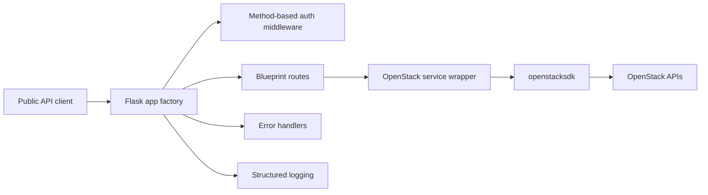

# openstack-middleware-api

A production-ready Flask middleware API for exposing selected OpenStack
infrastructure data through public, normalized REST endpoints. The API supports
OpenStack Application Credential auth for service deployments and
username/password auth for environments where application credentials are not
available.

## Architecture



- `app/__init__.py` creates the Flask app and wires configuration, middleware,
  Blueprints, logging, and error handlers.
- `app/routes/` contains thin route handlers for health checks and OpenStack
  resources.
- `app/services/openstack_client.py` owns all `openstacksdk` interaction and
  normalizes SDK resource objects into safe JSON payloads.
- `app/middleware/auth.py` applies reusable method-based bearer API key checks.
- `app/errors/handlers.py` returns consistent, client-safe error responses.
- `app/utils/logging.py` emits structured request logs without secrets.
- `tests/` mocks OpenStack behavior and verifies route, middleware, and service
  behavior.

## Directory Structure

```text
openstack-middleware-api/
├── app/
│   ├── __init__.py
│   ├── config.py
│   ├── routes/
│   │   ├── __init__.py
│   │   ├── health.py
│   │   └── openstack.py
│   ├── services/
│   │   ├── __init__.py
│   │   └── openstack_client.py
│   ├── middleware/
│   │   ├── __init__.py
│   │   └── auth.py
│   ├── errors/
│   │   ├── __init__.py
│   │   └── handlers.py
│   └── utils/
│       ├── __init__.py
│       └── logging.py
├── tests/
│   ├── test_health.py
│   ├── test_auth.py
│   ├── test_openstack.py
│   └── test_server_tags.py
├── instance/
├── .env.example
├── .gitignore
├── .pre-commit-config.yaml
├── LICENSE
├── pyproject.toml
├── README.md
└── run.py
```

## Installation

```bash
python3.12 -m venv .venv
source .venv/bin/activate
python -m pip install --upgrade pip
python -m pip install -e ".[dev]"
```

## Environment Variables

Copy the example file and fill in values for your environment:

```bash
cp .env.example .env
```

Required for protected write methods:

```text
API_KEY=
```

Required for OpenStack queries:

```text
OS_AUTH_TYPE=
OS_AUTH_URL=
OS_REGION_NAME=
OS_INTERFACE=
OS_IDENTITY_API_VERSION=
```

`OS_IDENTITY_API_VERSION` should normally be `3`, and `OS_INTERFACE` should
usually be `public`. `OS_AUTH_TYPE` defaults to `application_credential` when
unset for backward compatibility.

## OpenStack Auth Modes

The service supports two OpenStack auth modes:

- `application_credential`: recommended for service and middleware deployments.
  Application Credentials are usually already scoped to a project, so the app
  does not send `project_id`, `project_name`, or domain values in this mode.
- `password`: useful for local testing or environments where Application
  Credentials are not available.

### Application Credential Example

```dotenv
OS_AUTH_TYPE=application_credential

OS_AUTH_URL=https://openstack.example:5000/v3
OS_REGION_NAME=RegionOne
OS_INTERFACE=public
OS_IDENTITY_API_VERSION=3

OS_APPLICATION_CREDENTIAL_ID=your-application-credential-id
OS_APPLICATION_CREDENTIAL_SECRET=your-application-credential-secret
```

### Username/Password Example

```dotenv
OS_AUTH_TYPE=password

OS_AUTH_URL=https://openstack.example:5000/v3
OS_REGION_NAME=RegionOne
OS_INTERFACE=public
OS_IDENTITY_API_VERSION=3

OS_USERNAME=demo-user
OS_PASSWORD=your-password
OS_USER_DOMAIN_NAME=Default
OS_PROJECT_NAME=demo-project
OS_PROJECT_DOMAIN_NAME=Default
```

If Application Credential auth fails with `401 Unauthorized`, remove
`OS_PROJECT_ID` from the environment. Application Credentials are usually
project-scoped already, and sending an extra project scope can cause Keystone
authentication failures.

## Running Locally

```bash
source .venv/bin/activate
flask --app run:app run --debug
```

Or:

```bash
python run.py
```

For a production process manager, use Gunicorn:

```bash
gunicorn "run:app" --bind 0.0.0.0:5000 --workers 4
```

## REST API

Successful responses use:

```json
{
  "status": "success",
  "data": {}
}
```

Error responses use:

```json
{
  "status": "error",
  "message": "Description",
  "code": 404
}
```

Available public GET endpoints:

```text
GET /health
GET /api/v1/projects
GET /api/v1/servers
GET /api/v1/servers?tag=production
GET /api/v1/servers?tag=production&tag=web
GET /api/v1/servers/<server_id>
GET /api/v1/networks
GET /api/v1/images
GET /api/v1/flavors
```

## Example Curl Commands

```bash
curl http://localhost:5000/health
curl http://localhost:5000/api/v1/projects
curl http://localhost:5000/api/v1/servers
curl "http://localhost:5000/api/v1/servers?tag=production"
curl "http://localhost:5000/api/v1/servers?tag=production&tag=web"
curl http://localhost:5000/api/v1/servers/server-id
curl http://localhost:5000/api/v1/networks
curl http://localhost:5000/api/v1/images
curl http://localhost:5000/api/v1/flavors
```

Mutating methods are protected globally:

```bash
curl -X POST http://localhost:5000/api/v1/example \
  -H "Authorization: Bearer ${API_KEY}"
```

## Authentication Model

All `GET`, `HEAD`, and `OPTIONS` requests are public. `POST`, `PUT`, `PATCH`,
and `DELETE` requests require:

```http
Authorization: Bearer <API_KEY>
```

Missing authorization returns `401 Unauthorized`. Invalid API keys return
`403 Forbidden`. The middleware is method-based, so future write endpoints are
protected automatically.

The auth layer is intentionally small and isolated so it can be expanded later
with JWT validation, OAuth2, multiple API keys, RBAC, or rate limiting.

## Server Tag Filtering

`GET /api/v1/servers?tag=<tag>` supports OpenStack server tag filtering.
Multiple `tag` parameters are supported:

```text
GET /api/v1/servers?tag=production
GET /api/v1/servers?tag=production&tag=web
```

Multiple tags use AND matching, so a server must contain every requested tag to
be returned. The order of tag parameters does not affect matching. Duplicate
tags are ignored while preserving the first occurrence.

The API validates that tags are non-empty after trimming whitespace, at most 128
characters, and free of control characters. Invalid or empty tags return HTTP
400. The service first attempts native OpenStack SDK tag filtering with Nova's
comma-separated tag query syntax. If that is unavailable in the target cloud, it
safely fetches visible servers and filters by tag in the service layer.

## Running Tests

```bash
source .venv/bin/activate
pytest
ruff check .
black --check .
mypy app tests
```

## Pre-commit

```bash
source .venv/bin/activate
pre-commit install
pre-commit run --all-files
```

The pre-commit configuration runs Ruff, Ruff format, and mypy.

## Security Considerations

- Application Credential auth is recommended for production service use.
- Username/password auth is available for local testing or legacy environments.
- API keys, OpenStack secrets, tokens, and raw SDK exceptions are not returned
  to clients.
- Authentication failures are logged with reason codes, paths, and methods, but
  never with bearer tokens.
- OpenStack exceptions are translated into standardized client-safe responses.
- Public GET endpoints expose only normalized fields selected by the service.
- Run behind TLS and a reverse proxy in production.
- Store `.env` values in a secret manager for deployed environments.

## Future Enhancements

- JWT or OAuth2 authentication for mutating endpoints.
- Multiple API keys and key rotation metadata.
- RBAC for privileged operations.
- Rate limiting and abuse protection.
- OpenAPI schema generation.
- Pagination and sorting for large result sets.
- Response caching for slow OpenStack API calls.
- Metrics and tracing integration.
