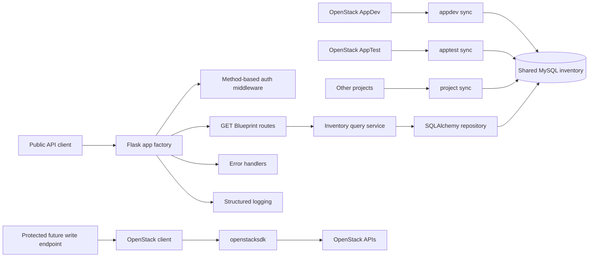

# openstack-middleware-api

A production-ready Flask middleware API for exposing selected OpenStack
infrastructure data through public, normalized REST endpoints. Public read
endpoints query one shared MySQL inventory database populated by the separate
`openstack-inventory-sync` project for multiple OpenStack projects. One API
service returns global inventory across all active inventory sources by default.
The OpenStack SDK client is retained for future authenticated mutating
endpoints.

## Architecture



- `app/__init__.py` creates the Flask app and wires configuration, middleware,
  Blueprints, logging, and error handlers.
- `app/routes/` contains thin route handlers for health checks and inventory
  resources.
- `app/database/` owns SQLAlchemy engine/session setup and read-only table
  descriptions for the sync-owned inventory schema.
- `app/repositories/inventory.py` owns active-source SQL queries, source
  filtering, and tag/address loading without implicit pagination.
- `app/services/inventory_query.py` validates request filters and normalizes
  database rows into safe public JSON payloads.
- `app/services/openstack_client.py` keeps lazy `openstacksdk` support for
  future authenticated write operations.
- `app/middleware/auth.py` applies reusable method-based bearer API key checks.
- `app/errors/handlers.py` returns consistent, client-safe error responses.
- `app/utils/logging.py` emits structured request logs without secrets.
- `tests/` uses SQLite-backed inventory fixtures for GET routes and keeps
  OpenStack client tests for future write behavior.

## Directory Structure

```text
openstack-middleware-api/
├── app/
│   ├── __init__.py
│   ├── config.py
│   ├── database/
│   │   ├── __init__.py
│   │   ├── engine.py
│   │   ├── models.py
│   │   └── session.py
│   ├── repositories/
│   │   ├── __init__.py
│   │   └── inventory.py
│   ├── routes/
│   │   ├── __init__.py
│   │   ├── health.py
│   │   └── openstack.py
│   ├── services/
│   │   ├── __init__.py
│   │   ├── inventory_query.py
│   │   └── openstack_client.py
│   ├── middleware/
│   │   ├── __init__.py
│   │   └── auth.py
│   ├── errors/
│   │   ├── __init__.py
│   │   └── handlers.py
│   └── utils/
│       ├── __init__.py
│       └── logging.py
├── tests/
│   ├── test_health.py
│   ├── test_inventory_api.py
│   ├── test_auth.py
│   ├── test_openstack.py
│   └── test_server_tags.py
├── instance/
├── .env.example
├── .gitignore
├── .pre-commit-config.yaml
├── AGENTS.md
├── LICENSE
├── pyproject.toml
├── README.md
└── run.py
```

## Installation

```bash
python3.12 -m venv .venv
source .venv/bin/activate
python -m pip install --upgrade pip
python -m pip install -e ".[dev]"
```

## Environment Variables

Copy the example file and fill in values for your environment:

```bash
cp .env.example .env
```

Required inventory and API settings:

```text
API_KEY=
INVENTORY_MAX_AGE_SECONDS=900
MYSQL_HOST=127.0.0.1
MYSQL_PORT=3306
MYSQL_DATABASE=openstack_inventory
MYSQL_USERNAME=openstack_api
MYSQL_PASSWORD=
MYSQL_CHARSET=utf8mb4
MYSQL_POOL_SIZE=5
MYSQL_MAX_OVERFLOW=10
MYSQL_POOL_RECYCLE=1800
```

`INVENTORY_SCOPE` is deprecated and ignored by the global API. If it remains in
an old environment file, it will not restrict results to AppDev, AppTest, or any
other single source. Use optional query parameters such as `?scope=appdev` when
a client wants to filter results.

GET endpoints do not require working OpenStack credentials at application
startup and do not query OpenStack. OpenStack configuration is retained for
future authenticated write endpoints and is validated lazily when the OpenStack
client is used.

```text
OS_AUTH_TYPE=
OS_AUTH_URL=
OS_REGION_NAME=
OS_INTERFACE=
OS_IDENTITY_API_VERSION=
```

`OS_IDENTITY_API_VERSION` should normally be `3`, and `OS_INTERFACE` should
usually be `public`. `OS_AUTH_TYPE` defaults to `application_credential` when
unset for backward compatibility.

## OpenStack Auth Modes

The service supports two OpenStack auth modes:

- `application_credential`: recommended for service and middleware deployments.
  Application Credentials are usually already scoped to a project, so the app
  does not send `project_id`, `project_name`, or domain values in this mode.
- `password`: useful for local testing or environments where Application
  Credentials are not available.

### Application Credential Example

```dotenv
OS_AUTH_TYPE=application_credential

OS_AUTH_URL=https://openstack.example:5000/v3
OS_REGION_NAME=RegionOne
OS_INTERFACE=public
OS_IDENTITY_API_VERSION=3

OS_APPLICATION_CREDENTIAL_ID=your-application-credential-id
OS_APPLICATION_CREDENTIAL_SECRET=your-application-credential-secret
```

### Username/Password Example

```dotenv
OS_AUTH_TYPE=password

OS_AUTH_URL=https://openstack.example:5000/v3
OS_REGION_NAME=RegionOne
OS_INTERFACE=public
OS_IDENTITY_API_VERSION=3

OS_USERNAME=demo-user
OS_PASSWORD=your-password
OS_USER_DOMAIN_NAME=Default
OS_PROJECT_NAME=demo-project
OS_PROJECT_DOMAIN_NAME=Default
```

If Application Credential auth fails with `401 Unauthorized`, remove
`OS_PROJECT_ID` from the environment. Application Credentials are usually
project-scoped already, and sending an extra project scope can cause Keystone
authentication failures.

## Inventory Database

The inventory schema is owned and migrated by `openstack-inventory-sync`. This
API defines read-only SQLAlchemy table descriptions for SELECT queries only. Do
not run Alembic migrations for inventory tables from this project, and do not
call `Base.metadata.create_all()` or any schema-creation behavior in the API.

Every resource query joins to active rows in `inventory_sources` and includes
`resource.inventory_source_id = inventory_sources.id`. Active resource rows are
filtered with `is_deleted = false`. Resource responses include safe source
identity so callers can distinguish AppDev, AppTest, and other inventory
sources.

Use a dedicated read-only MySQL identity for the API:

```sql
CREATE USER 'openstack_api'@'<API_SERVER_IP>'
  IDENTIFIED BY '<STRONG_PASSWORD>';

GRANT SELECT
ON openstack_inventory.*
TO 'openstack_api'@'<API_SERVER_IP>';

FLUSH PRIVILEGES;
```

## Running Locally

```bash
source .venv/bin/activate
flask --app run:app run --debug
```

Or:

```bash
python run.py
```

For a production process manager, use Gunicorn:

```bash
gunicorn "run:app" --bind 0.0.0.0:8000 --workers 4
```

Production should run one global API service, for example
`openstack-middleware-api.service`, on one backend port per API server. A common
topology is:

```text
HAProxy VIP
    |
    +-- df2v-osapi-01.ebsi.corp:8000
    +-- df2v-osapi-02.ebsi.corp:8000
```

Do not run separate API services or ports for AppDev, AppTest, or other
OpenStack projects.

## REST API

Successful responses use:

```json
{
  "status": "success",
  "data": {}
}
```

Error responses use:

```json
{
  "status": "error",
  "message": "Description",
  "code": 404
}
```

Available public GET endpoints:

```text
GET /health
GET /api/v1/inventory-sources
GET /api/v1/projects
GET /api/v1/servers
GET /api/v1/servers?tag=production
GET /api/v1/servers?tag=production&tag=web
GET /api/v1/servers?scope=appdev
GET /api/v1/servers/<server_id>
GET /api/v1/servers/<server_id>?scope=appdev
GET /api/v1/networks
GET /api/v1/images
GET /api/v1/flavors
```

Collection endpoints return all matching active rows from all active inventory
sources by default. There is no default pagination, no implicit 100-row limit,
and no pagination metadata. Collection responses include `meta.count`.

Resource responses include source identity:

```json
{
  "id": "server-uuid",
  "name": "DF2V-WEBCOR-Q02",
  "inventory_source": {
    "id": 3,
    "scope": "appdev",
    "project_id": "279964236c2e4d15b9a1bae1952f9e9d",
    "project_name": "DF-APPDEV",
    "region_name": "RegionOne"
  }
}
```

Optional source filters are supported:

```text
?scope=appdev
?project_id=<OpenStack project UUID>
?project_name=DF-APPDEV
?region=RegionOne
```

`GET /api/v1/servers/<server_id>` searches all active sources. If the server ID
exists in more than one active source, the API returns HTTP 409 and the caller
should add a source filter such as `?scope=appdev`.

`GET /health` returns application and database health plus global inventory
source counts, stale source counts, failed source counts, and oldest/newest
successful sync timestamps. Unreachable MySQL or zero active inventory sources
returns HTTP 503 with a sanitized error response. Stale inventory sources return
HTTP 200 with visible stale scope information so one delayed project sync does
not unnecessarily remove the whole API from load balancers.

## Example Curl Commands

```bash
curl http://api.ebsi.corp/health
curl http://api.ebsi.corp/api/v1/inventory-sources
curl http://api.ebsi.corp/api/v1/projects
curl http://api.ebsi.corp/api/v1/servers
curl "http://api.ebsi.corp/api/v1/servers?scope=appdev"
curl "http://api.ebsi.corp/api/v1/servers?tag=preview&tag=windows-exporter"
curl "http://api.ebsi.corp/api/v1/servers/server-id?scope=appdev"
curl http://api.ebsi.corp/api/v1/networks
curl http://api.ebsi.corp/api/v1/images
curl http://api.ebsi.corp/api/v1/flavors
```

Mutating methods are protected globally:

```bash
curl -X POST http://api.ebsi.corp/api/v1/example \
  -H "Authorization: Bearer ${API_KEY}"
```

## Authentication Model

All `GET`, `HEAD`, and `OPTIONS` requests are public. `POST`, `PUT`, `PATCH`,
and `DELETE` requests require:

```http
Authorization: Bearer <API_KEY>
```

Missing authorization returns `401 Unauthorized`. Invalid API keys return
`403 Forbidden`. The middleware is method-based, so future write endpoints are
protected automatically.

The auth layer is intentionally small and isolated so it can be expanded later
with JWT validation, OAuth2, multiple API keys, RBAC, or rate limiting.

## Server Tag Filtering

`GET /api/v1/servers?tag=<tag>` supports MySQL-backed server tag filtering.
Multiple `tag` parameters are supported:

```text
GET /api/v1/servers?tag=production
GET /api/v1/servers?tag=production&tag=web
```

Multiple tags use AND matching, so a server must contain every requested tag to
be returned. The order of tag parameters does not affect matching. Duplicate
tags are ignored while preserving the first occurrence.

Tag filters combine with source filters:

```text
GET /api/v1/servers?scope=appdev&tag=preview&tag=windows-exporter
```

The API validates that tags are non-empty after trimming whitespace, at most 128
characters, and free of control characters. Invalid or empty tags return HTTP
400. Matching is performed in SQL with a grouped `server_tags` query and
`HAVING COUNT(DISTINCT tag) = requested_tag_count`; the API does not load every
server and filter tags in Python.

## Running Tests

```bash
source .venv/bin/activate
pytest
ruff check .
black --check .
mypy app tests
```

## Pre-commit

```bash
source .venv/bin/activate
pre-commit install
pre-commit run --all-files
```

The pre-commit configuration runs Ruff, Ruff format, and mypy.

Optional MySQL integration testing should use a disposable database populated by
`openstack-inventory-sync` migrations. The default test suite uses SQLite and
does not require a real MySQL server.

## Production Upgrade

1. Deploy and verify `openstack-inventory-sync` first so MySQL has current
   `inventory_sources` and resource rows for every target project.
2. Create a dedicated API MySQL user with `SELECT` only.
3. Configure one API service with the shared MySQL environment variables.
4. Deploy this API version and check `/health` for `database=healthy` and the
   expected active inventory source count.
5. Confirm `/api/v1/servers` returns all active sources without OpenStack API
   traffic and without requiring callers to page through results.

Rollback is the previous API version plus its previous environment. Keep the
sync service running during rollback unless the prior API version explicitly
does not need inventory freshness. If MySQL is unavailable, this version returns
503 for GET endpoints instead of falling back to OpenStack.

## Future Write Operations

The OpenStack client and auth modes remain available for future `POST`, `PUT`,
`PATCH`, and `DELETE` endpoints, but this change does not add any mutating
routes. A single OpenStack Application Credential is scoped to one project, so
future multi-project writes will need a safe credential-selection design. A
future write endpoint must identify the target inventory source/project and load
the appropriate OpenStack credential securely. Database values such as
`inventory_sources.auth_url` must never be treated as OpenStack credentials.
Current GET startup does not depend on valid OpenStack credentials, and
OpenStack initialization remains lazy.

## Security Considerations

- Use a dedicated read-only MySQL account with `SELECT` privileges only.
- Application Credential auth is recommended for future protected OpenStack
  write operations.
- Username/password auth is available for local testing or legacy environments.
- API keys, OpenStack secrets, tokens, and raw SDK exceptions are not returned
  to clients.
- Authentication failures are logged with reason codes, paths, and methods, but
  never with bearer tokens.
- Database and OpenStack exceptions are translated into standardized client-safe
  responses.
- Public GET endpoints expose only normalized fields selected by the service.
- Run behind TLS and a reverse proxy in production.
- Store `.env` values in a secret manager for deployed environments.

## Future Enhancements

- JWT or OAuth2 authentication for mutating endpoints.
- Multiple API keys and key rotation metadata.
- RBAC for privileged operations.
- Rate limiting and abuse protection.
- OpenAPI schema generation.
- Additional inventory-backed routes for subnets, ports, volumes, floating IPs,
  and security groups.
- Metrics and tracing integration.
